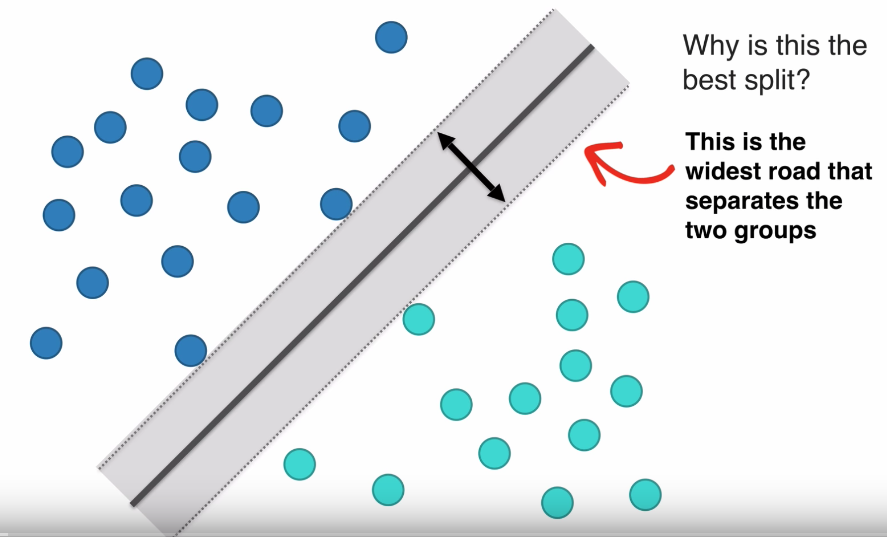
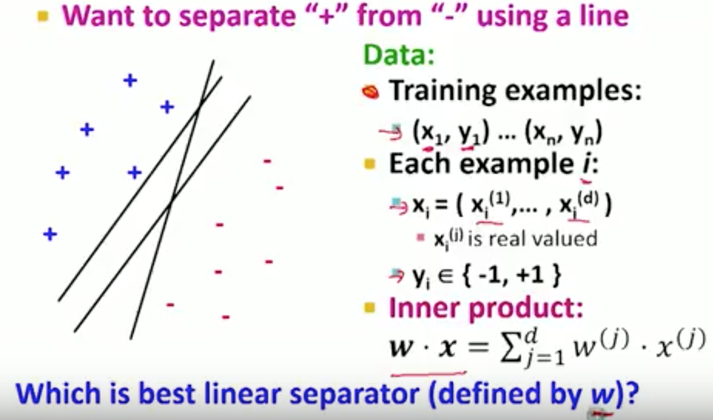
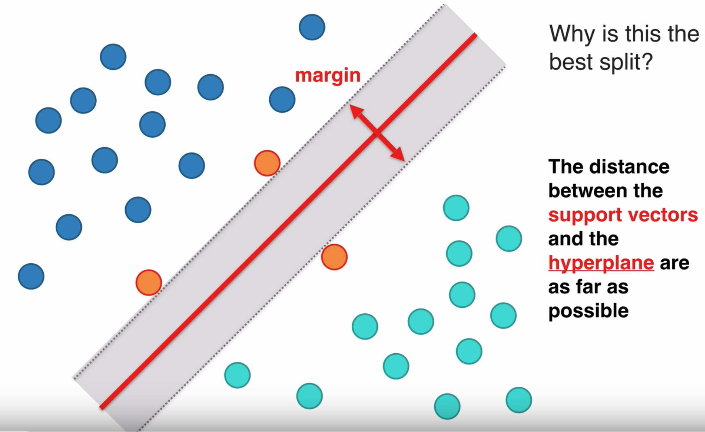
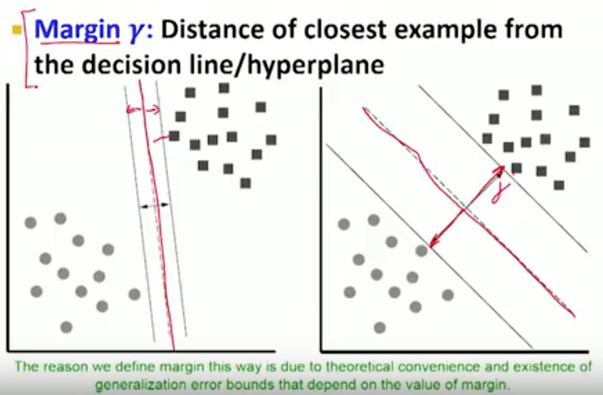
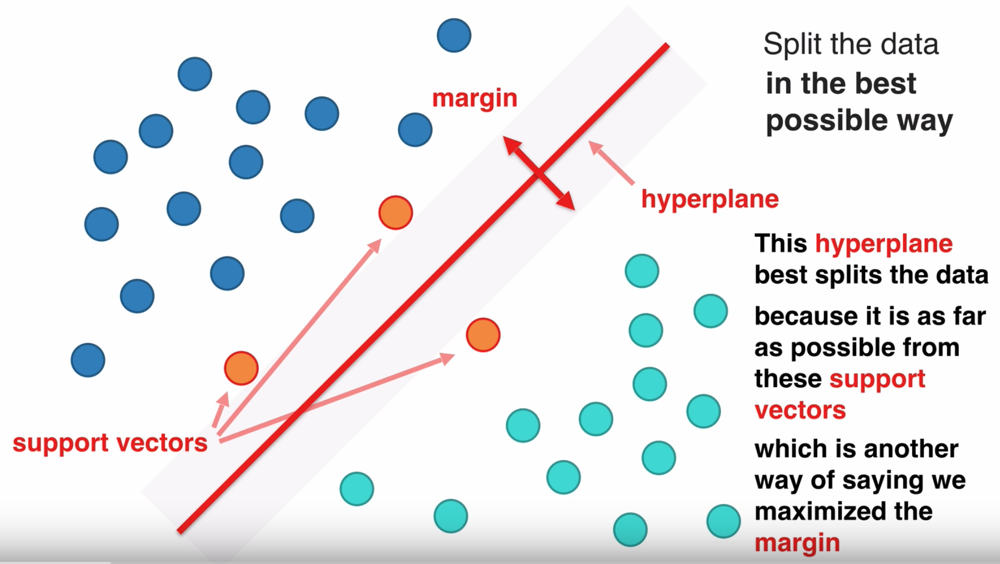
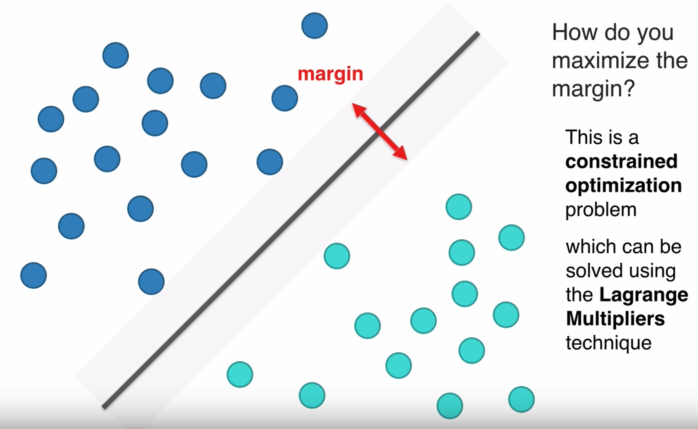
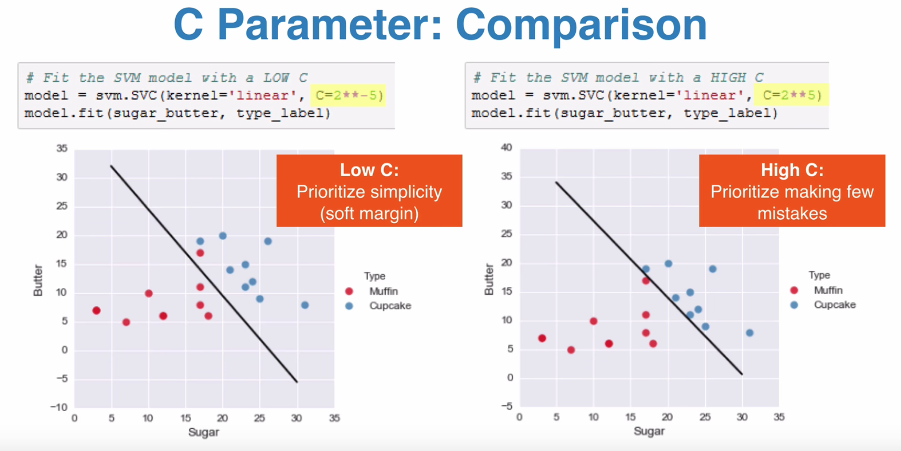
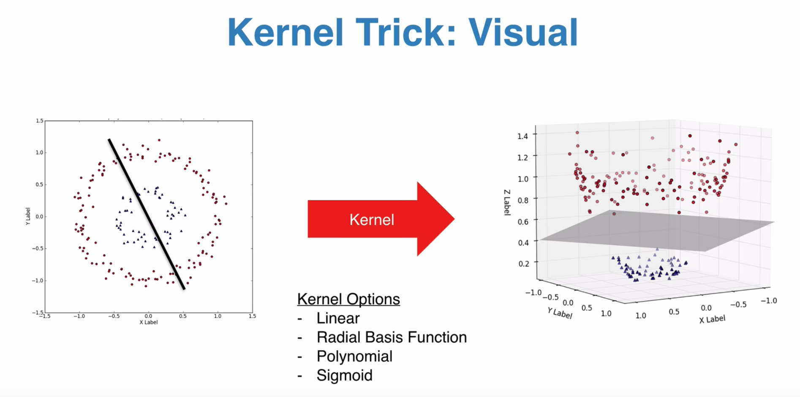

### What is a Classifier?

* You can think of a classifier as a function that takes in some data as input, and returns a label as output
* Supervised learning: create a classifier by finding patterns in examples

### Sample Support Vector Machine

* A support vector machine is a classification technique
* A support vector machine is, at the end of the day, a model that best splits clusters of data
* SVMs are good at dealing with high-dimensional data, and works well on small datasets
* The distance between the data points and the svm model should be as wide as possible
* The points are called support vectors, and the `line` generated by the model is called the hyperplane
* Need to normalize the data

### What is the C Parameter?

* The C parameter tells the SVM optimization how much you want to avoid misclassifying each training example.
* For large values of C, the optimization will choose a smaller-margin hyperplane if that hyperplane does a better job of getting all the training points classified correctly.
* Conversely, a very small value of C will cause the optimizer to look for a larger-margin separating hyperplane, even if that hyperplane misclassifies more points.
* For very tiny values of C, you should get misclassified examples, often even if your training data is linearly separable.

### Terms

* Receptive field: what set of inputs makes the value of this neuron as high as it can possibly be
* Sigmoid squashing function: put a value in (x-value), where it crosses the sigmoid function is your output value (y-value), no matter where you are, the value is always between 1 and -1
* Rectified linear units: if value is negative, make it zero, if it is positive, keep the value

### Relevant Mathematical Concepts

* Constrained optimization
* Lagrange multipliers

### Resources

* https://www.youtube.com/watch?v=N1vOgolbjSc
* https://github.com/adashofdata/muffin-cupcake
* https://www.youtube.com/watch?v=ax8LxRZCORU

